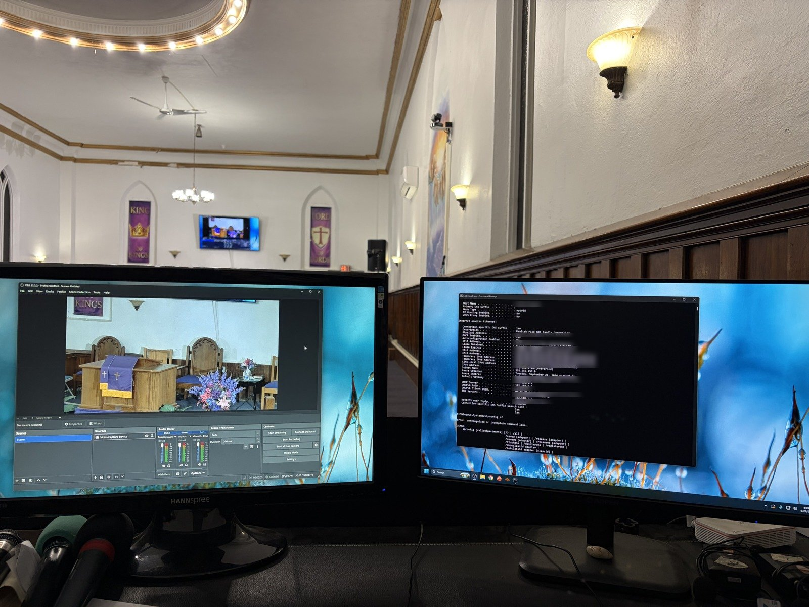
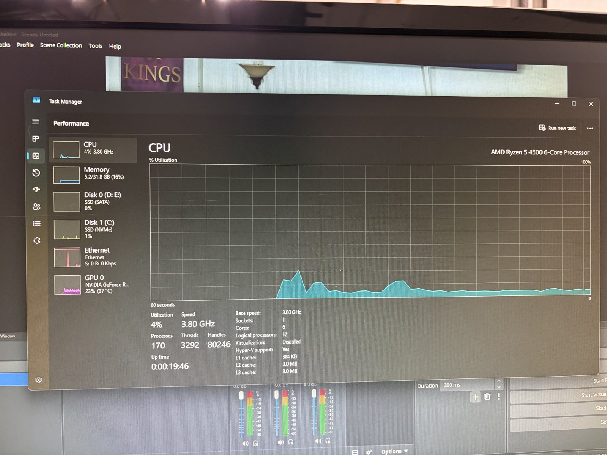
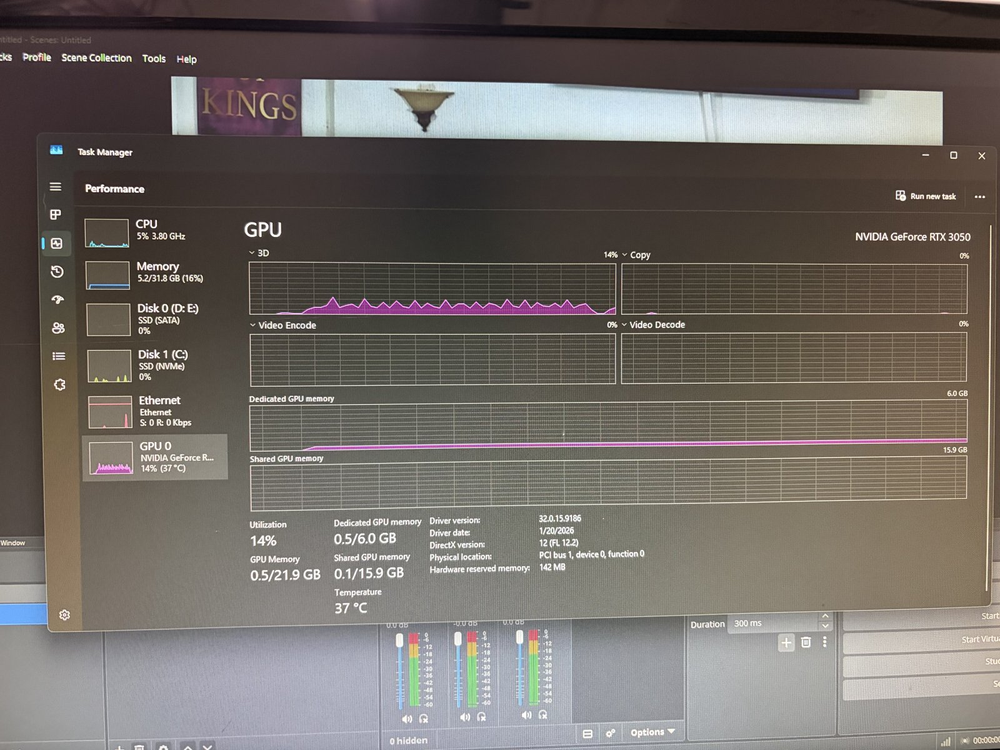
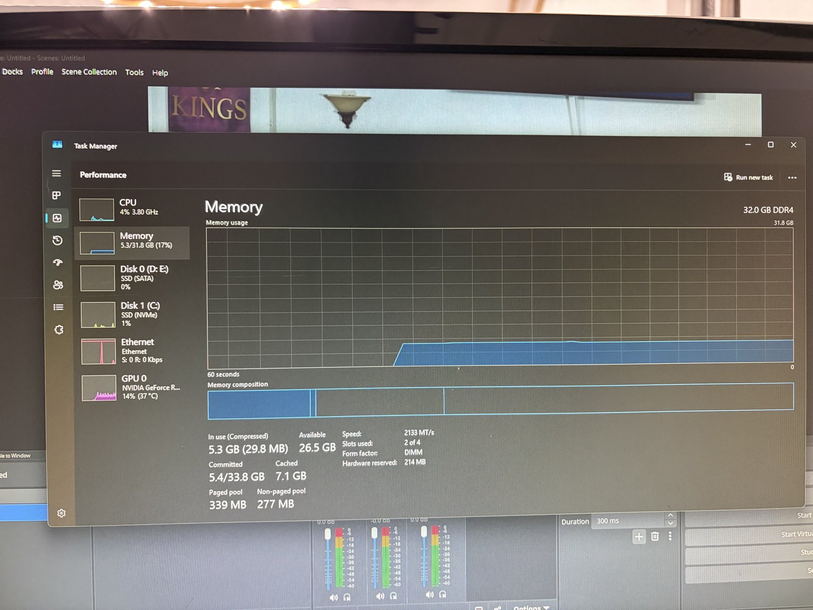
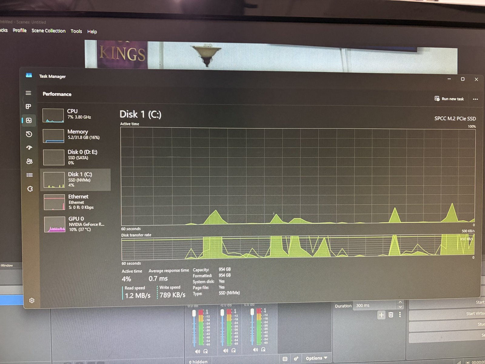
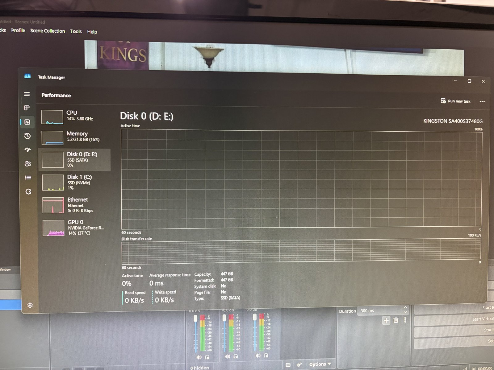
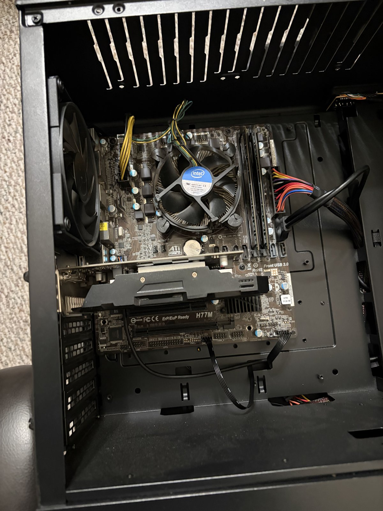

# Church Livestream PC

I built a new livestreaming PC for a local church and set up the network behind it, including running the cables and connecting the cameras. The PC runs OBS with the camera on the sanctuary wall and drives two monitors at the booth.



*OBS on the left with the camera on the pulpit. ipconfig on the right, with the MAC address, public IPv6 addresses, and hostname blurred.*

## Specs

- **CPU:** AMD Ryzen 5 4500 (6 cores / 12 threads)
- **RAM:** 32 GB DDR4 (2 × 16 GB)
- **GPU:** NVIDIA RTX 3050 6 GB
- **Boot drive:** 1 TB NVMe SSD
- **Storage:** 480 GB Kingston A400 SATA SSD for recordings and media
- **OS:** Windows 11
- **Network:** Wired Ethernet

The RTX 3050 handles stream encoding through NVENC, so the CPU stays mostly idle while OBS is running.

Screenshots from Task Manager showing the specs:

<p align="center">
  
  
</p>
<p align="center">
  
  
  
</p>

## The old PC

This is the PC the church was using before. It's an Intel machine on an ASRock H77M board (LGA 1155) with the stock cooler. That platform is over 10 years old and isn't powerful enough for livestreaming, so I replaced it with the new build.

- **CPU:** Intel Core i5-3470
- **Motherboard:** ASRock H77M (LGA 1155)
- **GPU:** AMD RX 480
- **RAM:** 8 GB
- **Storage:** 256 GB SSD

<p align="center">
  
</p>

## What I did

1. Swapped the old H77M system for the new Ryzen build
2. Installed Windows 11 on the NVMe drive, then updates and NVIDIA drivers
3. Kept the OS on the NVMe and put recordings on the SATA drive so the system drive doesn't fill up
4. Set up OBS with the camera as a video capture source and configured the audio inputs
5. Set up the network: ran and routed the cables, connected the cameras, and wired the PC in over Ethernet

## Network

```
Internet
   |
Router
   |  (Ethernet)
   +-- Livestream PC
   +-- Sanctuary devices (camera, TV)
```

I set up the network myself. I ran and routed the cables and connected the sanctuary cameras so their feeds reach the booth PC. I wired the PC to the router instead of using Wi-Fi, because a livestream needs a steady upload connection. It gets its address from the router over DHCP. I checked the IP, gateway, and DNS with `ipconfig /all`, and both IPv4 and IPv6 are working.

## Skills used

**Hardware assessment and budget planning.** I looked at the church's existing PC, identified why it couldn't handle livestreaming (an aging i5-3470 platform, 8 GB of RAM, and no modern hardware encoder), and picked a replacement sized for the workload. That meant a 6-core Ryzen, 32 GB of RAM, and an RTX 3050 so NVENC handles encoding instead of the CPU. I worked within a strict budget, choosing parts that cover the church's streaming needs without overspending.

**PC building.** I assembled the new system from components, including the CPU, memory, GPU, and both NVMe and SATA storage.

**OS deployment and configuration.** I installed Windows 11, applied updates, and installed the GPU drivers. I set up the storage so the OS lives on the fast NVMe drive and recordings go to a separate SSD, which keeps the system drive from filling up during long services.

**Network installation.** I ran and routed the cabling, connected the sanctuary cameras, and wired the stream PC into the router over Ethernet. I chose wired over Wi-Fi so the stream would have a stable upload connection.

**Verification and troubleshooting.** I confirmed IP addressing, DHCP, the default gateway, and DNS with `ipconfig /all`, and checked IPv4 and IPv6 connectivity. I also used Task Manager to verify that every component was detected and running as expected.

**Livestream setup.** I configured OBS Studio with the camera as a video capture source and set up the audio mixer inputs, so the church can stream and record services from the booth.

**Working with a non-technical client.** I handled the project end to end on my own, from assessment to a working setup that volunteers can use.
